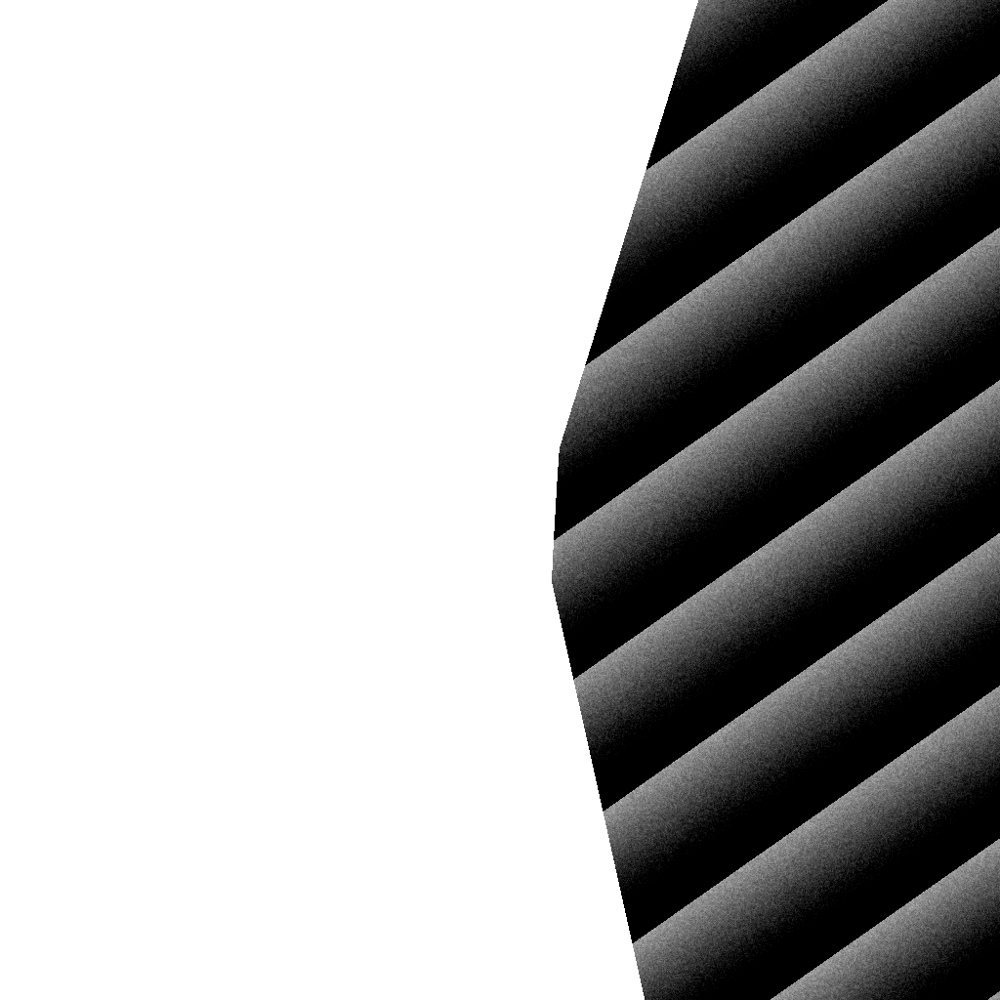
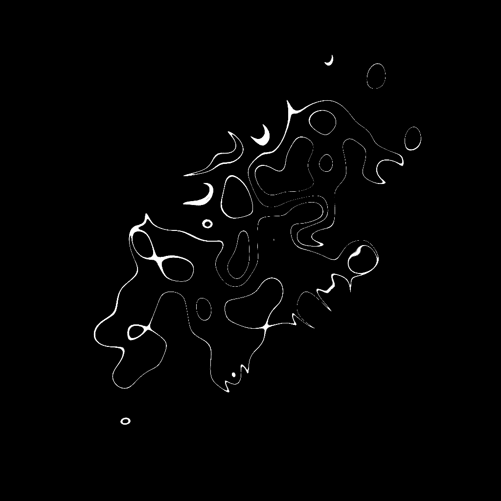

# GLSL Playgrounds 2

A place to learn GLSL shaders.

107 Texture Coordinates  

106 Geometry Postprocess  

105 Geometry Rotate  

104 Ramp Grain  

103 Noise Displace  

102 Pass Blur  

101 Rachmarch Mask  

100 Blend Spheres  

