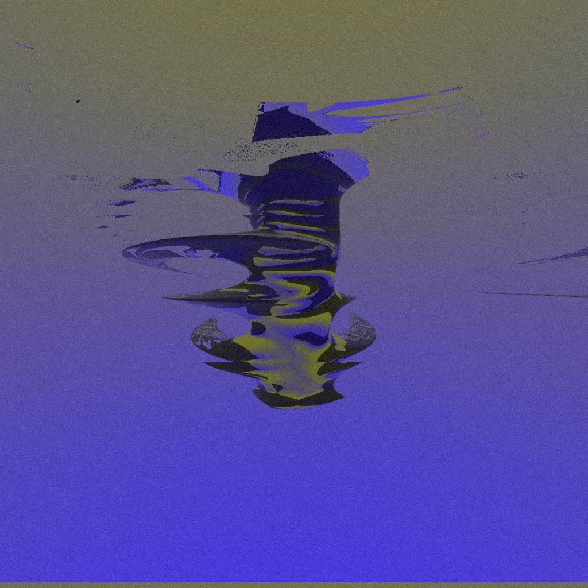
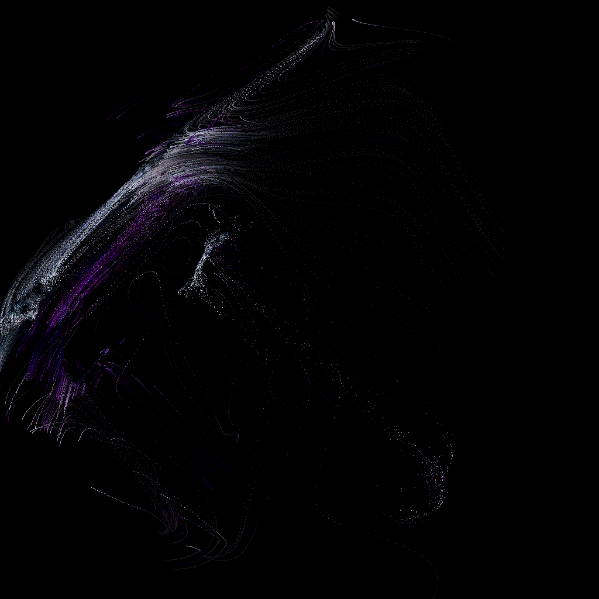
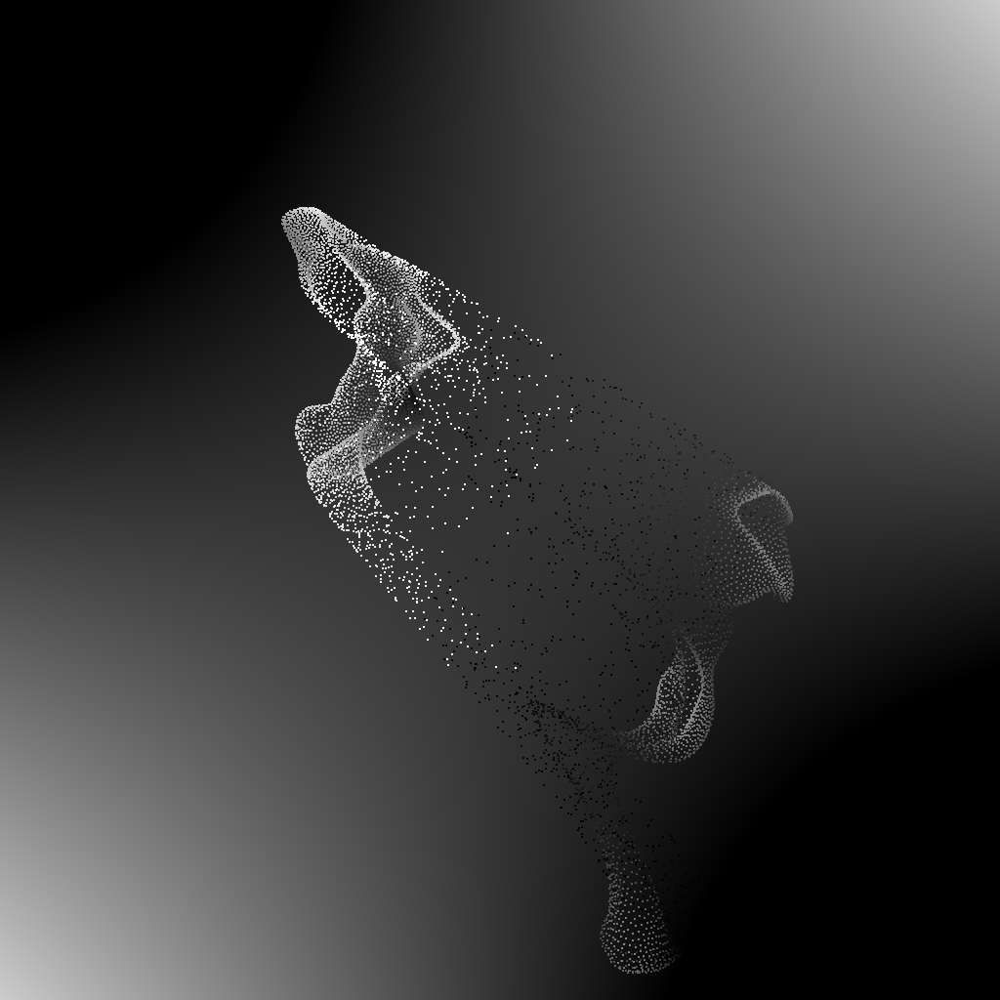

# GLSL Playgrounds 2

A place to learn GLSL shaders.

124 Recolor Displace  

123 Glass Blend  

122 Twist Band  

121 Glass Star  

120 Glass Union  

119 Refractive Shapes  

118 Repeat Space  

117 Scene Displace  

116 Sphere Trace  

115 Grid Feedback  

114 Doublebuffer Feedback  

113 Point Color  

112 Point Noise  

111 Displace Points  

110 Pointcloud Size  

109 Rect Pattern  

108 Geometry Scale  

107 Texture Coordinates  

106 Geometry Postprocess  

105 Geometry Rotate  

104 Ramp Grain  

103 Noise Displace  

102 Pass Blur  

101 Rachmarch Mask  

100 Blend Spheres  

